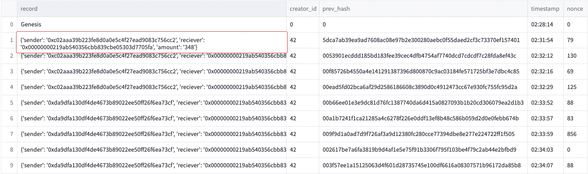
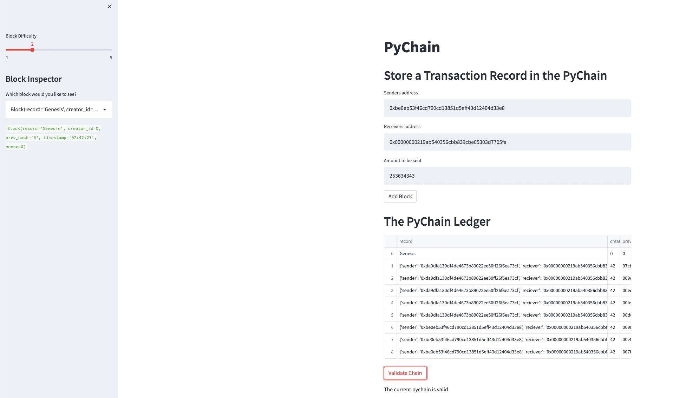

# Fintech--python-blockchain

The pychain excersise was to build a blockchain using the python programming language and display the key attributes of a blockchain using a streamlit web app [(View the app here).](https://epicosp-fintech--python-blockchain-pychain-ixpimo.streamlitapp.com/)

## Pychain
The structure of the python blockchain was built using dataclasses to handle the blockchain functionality. Instances of the classes store and manipulate the data,  validation is done using the python hashlib library and chain validation is done by checking the entire chain hash.

## Streamlit app
The streamlit app can inspect blocks, change hashing difficulty and add blocks (with data) to the blockchain. Some basic error handling was implemented to stop invalid transaction amounts being placed onto the blockchain.

